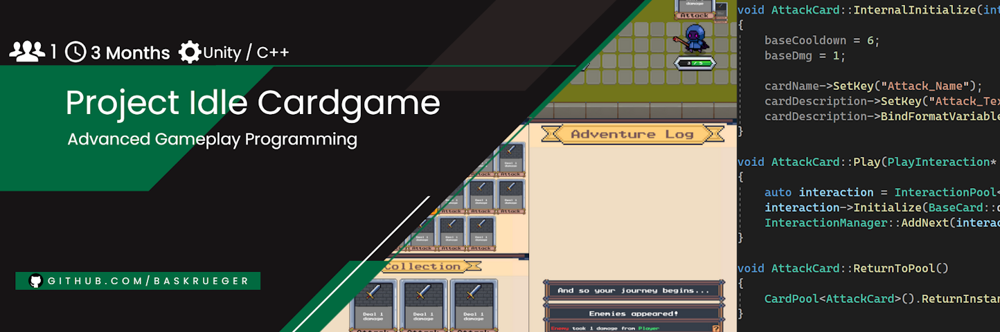
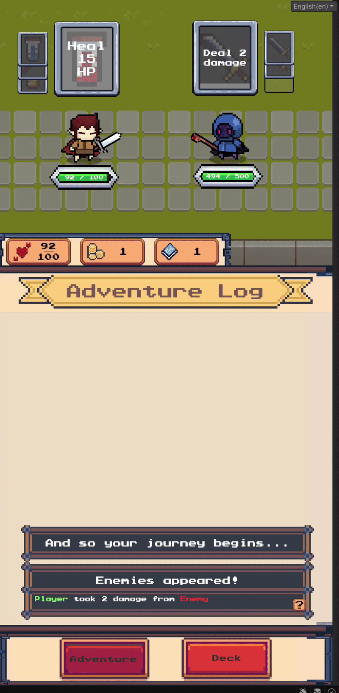
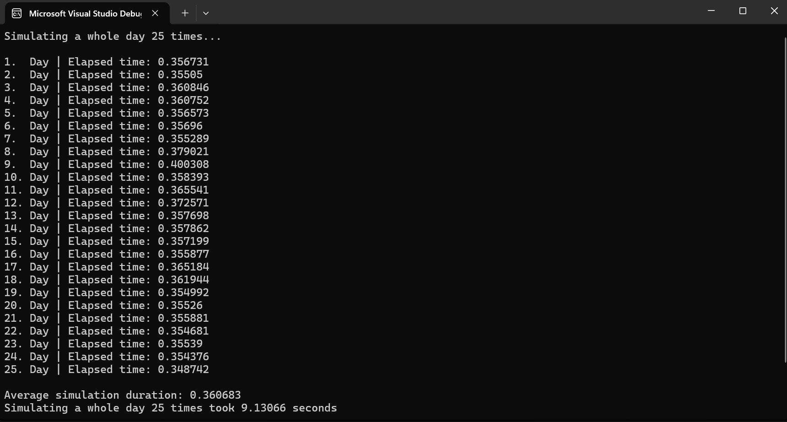

<p align="center"> <br> </p>
Project Idle Cardgame is my most ambitious project to date: an idle card game where every second of missed gameplay is simulated with 100% accuracy. While the frontend runs in Unity, the core gameplay logic is written in C++ to achieve the performance needed to simulate 24 hours of gameplay in under half a second.

# Gameplay Overview
You play as an adventurer constantly seeking new encounters. When you meet an enemy, both you and the opponent begin charging a card. Once charged, the card is played, and the next card in your deck is drawn. Winning encounters rewards you with new cards and resources, allowing you to refine your deck between battles.

The game continues running even when you're offline. Simply open it once or twice a day to discover new cards, strengthen your deck, and then close it again. Unlike typical idle games that provide generic AFK rewards, every single second you’re away is fully simulated—making it feel like the game never stopped running.

<p align="center">    </p>

# Highlight: Unity Meets C++ via MVC
The core gameplay is implemented using the Model-View-Controller (MVC) design pattern, where the C++ module acts as the Model—responsible for maintaining and updating the entire game state. This module is compiled into a C-compatible DLL, which Unity loads and interacts with using C#.

Unity and its C# scripts handle the View and Controller responsibilities:

- Controller: Inputs such as player actions (e.g., selecting a card) are sent to the C++ backend.
- Model: The C++ DLL simulates the logic, updates the game state, and returns the result.
- View: Unity reads the resulting game state as a JSON object and renders it visually.

This architecture ensures a clean separation of concerns:

- C++ provides raw performance and direct control over memory, enabling extremely fast simulation.
- Unity focuses on presentation and user interaction, benefiting from its mature UI and animation systems.

Thanks to this structure, simulating an entire 24-hour offline session takes less than half a second.

<p align="center"> <br> </p>

# Highlight: The Interaction System
One of the most exciting elements in a card game is pulling off powerful combos. To support this, I developed a modular Interaction System.

Rather than executing actions directly, all game events—such as dealing damage, healing, or applying buffs—are wrapped into specialized Interaction classes. These are passed to a central Interaction Manager, which broadcasts them to all relevant listeners (Interactors) before execution. Because the interaction objects are mutable, listeners can alter their values dynamically, enabling complex, responsive game mechanics.

Take the SpikeShieldCard, for example. Its effect reads:
"While charging, reduce incoming damage by 1 and deal it back."

Here's how that’s implemented:
```
//Listen to before anything deals damage
void SpikeShieldCard::Before(DamageInteraction* interaction)
{

    //If the character that holds this card is supposed to take damage

	if (interaction->pTarget->pOwner == this->pOwner) 
	{

        //Reduce the incoming damage by 1

		interaction->attackDamage -= 1;
		if (interaction->attackDamage <= 0) return;

        //Create a new DamageInteraction that comes from this and targets the character that damaged this one

		auto inter = InteractionPool<DamageInteraction>().GetInstance(this, interaction->pSource);
		inter->attackDamage = interaction->attackDamage;
		InteractionManager::AddNext(inter);

	}
}
```

