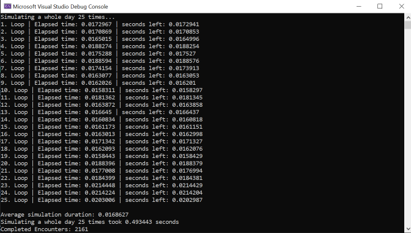

# Project Idle Cardgame

     

"Project Idle Cardgame" is my most ambitious project yet. While the game itself runs with Unity, the actual gameplay runs through an C DLL (written in C++) to provide the necessary performance that enables me to simulate a 24 hours of gameplay in less than a full second. 
This project is in active development.

# Gameplay

     

You play as an Adventurer that's constantly on the lookout for new encounters. One of these are combat both sides automatically play their cards until either side reaches 0 hp. Completing encounters rewards you with more cards and ressources, allowing you to improve your deck between fights.
In addition this project keeps running even if you don't actively play the game. Open the game 1-2 times a day, see what awesome new stuff you got, improve your deck and put the game aside until next day.

# Higlight: Gameplay Performance through DLL:

     

One major benefit of the MVC pattern is that I can call the Update (or called "Tick" in this game) function of the pure gameplay seperate from the entire rest of the game. Originally the gamemodel was written inside Unity as C# scripts similar to how it worked in ["Not Skystone"](https://github.com/BasKrueger/Not-Skystone-2.0/tree/main).
Eventually I reached a point where I had all basic game fetures in place, however I wasn't satisfied with the performance at all.  
Simulating a whole day took roughly 5 seconds. That's barely what I consider acceptable for a mobile game, however I expected the game and the complexity of gameplay interactions to still grow significantly to grow from that point.
So I decided start over with gamemodel.  

However this time I chose C++ as the development language and after recreating all previously existing features, and applying some additional performance saving techniques like object pooling, I managed to <b>reduce the simulation of 5 seconds to only 0.016</b> on average. Giving me plenty of extra space for the future development of this project.
